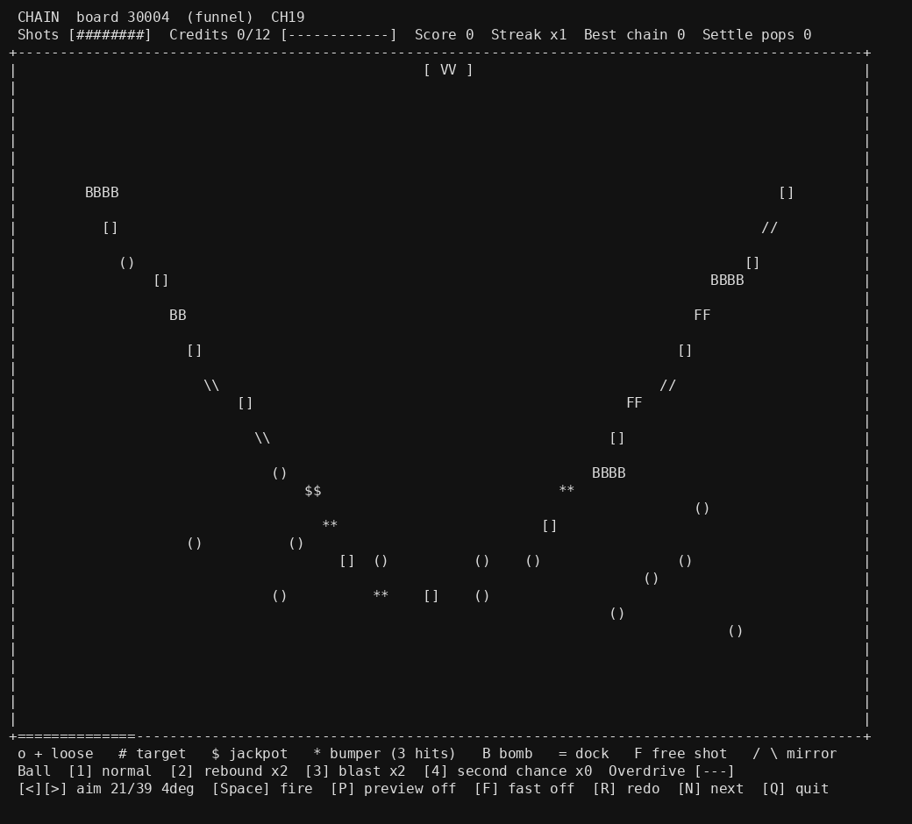

# CHAIN

A terminal game in Python. Aim a cannon, fire a ball into a board of pegs and targets, and clear every board in a run. Python 3 standard library only.

**Status: work in progress.** Version CH19.  The board is half-width with every cell two columns wide (50 cells across), so sprites are bigger in the same terminal size, CH17 added an Overdrive meter, and CH18 added three new board shapes (spiral, funnel, stairs), and CH19 marks one target on each board as a jackpot worth +500 extra. Run codes from CH18 and earlier no longer work. Everything below is builder-reported from my own automated tests. Not tested: a real Windows console, a person playing a full run, colour by a human eye.

## Run it

- Linux or macOS: `python3 ChainDemo.py --menu`
- Windows: keep `ChainDemo.py`, `Play.bat` and `PlayText.bat` in one folder and double-click `Play.bat`. Windows is untested.

The terminal needs at least 104 columns by 48 rows. `HowToRun.txt` has the keys and rules and the display options (`--mono`, `NO_COLOR`, `--ascii`, `--delay`, `--text`).

## What a run is

Three boards. Earn the credit quota on each (9, 10, 10; one credit per target cleared) within 8 base shots (dock and heart bonus shots can add more). A dock sweeps the floor: land the ball in it for a free shot and +400 (first 2 catches per board). Overdrive: every shot with a rally of x3 or more fills one segment of a three-segment meter; the third segment gives one extra Rebound ball for that board only (once per board, not carried to the next). Press D on the menu for the daily run. The run code printed on exit replays the whole run; codes from CH18 and earlier no longer work.

The picture is the game's own frame (a funnel board, plain text mode, jackpot shown as $$) rendered to an image without colour, not a live terminal capture.

## Tests

The `*15` scripts (`ChainTest15.py`, `DockTest15.py`, `KeyTest15.py` and the rest) assert and exit non-zero on failure. They are my own tests, so treat results as builder-reported. `PtyDrive15.py` plays whole runs through a real pseudo-terminal.

`TagTest16.py` checks the floating score tag drawing, and `OverdriveTest17.py` checks the Overdrive meter (fills, one bonus ball per board, replay and resume, HUD width).

`BalanceCH17.py` prints reproducible clear-rate numbers for seeds 30001..30300 (`python3 BalanceCH17.py [first_seed] [count]`). The policy is the bot from `ChainTest15.py`, plus a random-aim baseline. It measures how often a simple bot and random aim clear boards. It does not measure human difficulty.

`MessageFitTest17.py` checks that the shot message always fits the screen with its score and reward text intact, and that the Overdrive meter flash only changes colour.

`RecapTest17.py` checks the board-end recap line ("N targets left to clear", or the cleared-in summary) and the per-board summary printed after the run code, against an independent recount.

`ColorEnvTest17.py` checks that the NO_COLOR environment variable turns colour off, and that the "window too small" size matches the real board.

`LayoutTest18.py` checks the three new board shapes over 1200 seeds: they never fall back to scatter, always have 12 targets, keep target spacing, give an opening shot a reasonable reach, and are cleared by the test bot about as often as the older shapes. It does not measure how fun they are. `LayoutMeasure18.py` prints the per-shape table.

`JackpotTest19.py` checks the jackpot target: one per board, always a real target, +500 paid once and only on the shot that clears it, no effect on the layout, replay agreement, and the drawing. `JackpotMeasure19.py CH18_FOLDER` compares CH19 with a CH18 copy on the same seeds (clear results are identical because only scoring changed).
